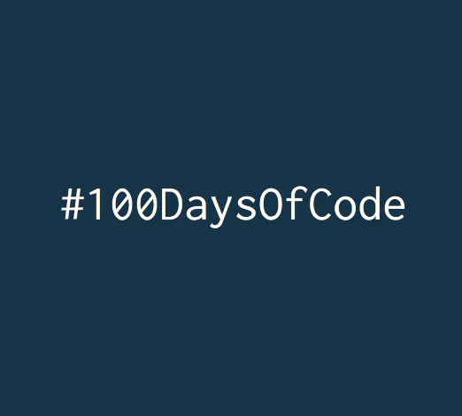

# 🔥100DaysOfCode

Collaboration project of React & Tailwind

## Download

Computer Version:

## See the development of the project:

To see the development go to the planning

## Made with:

## 🤝 Contributions

Project open for help!

Please follow the licensing requirements...

## 🔖 licence

## 💰 Donate

### Contact me

Copyright © 2021 Manuekle
